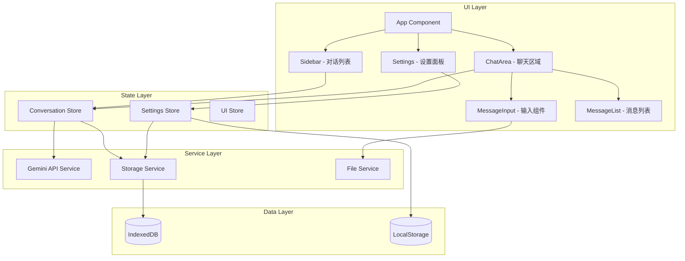

# 设计文档

## 概述

Gemini Chat 是一个基于 Web 的聊天客户端，专门为 Google Gemini AI 设计。采用现代前端技术栈，提供响应式界面和流畅的用户体验。应用支持多模态输入（文本、图片、文件），完整的 Gemini API 参数配置，以及本地数据持久化。

### 技术选型

- **前端框架**: React 18 + TypeScript
- **构建工具**: Vite
- **状态管理**: Zustand（轻量级状态管理）
- **样式方案**: Tailwind CSS
- **Markdown 渲染**: react-markdown + remark-gfm + rehype-highlight
- **数学公式**: KaTeX
- **本地存储**: IndexedDB（通过 idb 库）
- **HTTP 客户端**: 原生 fetch API（支持流式响应）

## 架构



## 组件和接口

### 核心服务接口

#### GeminiService - Gemini API 服务

```typescript
// Gemini API 请求格式
interface GeminiRequest {
  contents: GeminiContent[];
  generationConfig?: GenerationConfig;
  safetySettings?: SafetySetting[];
  systemInstruction?: GeminiContent;
}

interface GeminiContent {
  role: 'user' | 'model';
  parts: GeminiPart[];
}

type GeminiPart = 
  | { text: string }
  | { inlineData: { mimeType: string; data: string } };

interface GenerationConfig {
  temperature?: number;      // 0-2, 默认 1
  topP?: number;            // 0-1, 默认 0.95
  topK?: number;            // 默认 40
  maxOutputTokens?: number; // 最大输出 token 数
  stopSequences?: string[]; // 停止序列
}

interface SafetySetting {
  category: HarmCategory;
  threshold: HarmBlockThreshold;
}

type HarmCategory = 
  | 'HARM_CATEGORY_HARASSMENT'
  | 'HARM_CATEGORY_HATE_SPEECH'
  | 'HARM_CATEGORY_SEXUALLY_EXPLICIT'
  | 'HARM_CATEGORY_DANGEROUS_CONTENT';

type HarmBlockThreshold = 
  | 'BLOCK_NONE'
  | 'BLOCK_LOW_AND_ABOVE'
  | 'BLOCK_MEDIUM_AND_ABOVE'
  | 'BLOCK_ONLY_HIGH';

// Gemini API 响应格式
interface GeminiResponse {
  candidates: {
    content: GeminiContent;
    finishReason: string;
    safetyRatings: SafetyRating[];
  }[];
  usageMetadata?: {
    promptTokenCount: number;
    candidatesTokenCount: number;
    totalTokenCount: number;
  };
}

interface GeminiService {
  // 发送消息并获取流式响应
  sendMessage(
    contents: GeminiContent[],
    config: ApiConfig,
    generationConfig?: GenerationConfig,
    safetySettings?: SafetySetting[],
    systemInstruction?: string,
    onChunk: (text: string) => void
  ): Promise<void>;

  // 测试 API 连接
  testConnection(config: ApiConfig): Promise<boolean>;

  // 构建请求 URL
  buildRequestUrl(config: ApiConfig, stream: boolean): string;
}
```

#### StorageService - 存储服务

```typescript
interface StorageService {
  // 对话操作
  saveConversation(conversation: Conversation): Promise<void>;
  getConversation(id: string): Promise<Conversation | null>;
  getAllConversations(): Promise<Conversation[]>;
  deleteConversation(id: string): Promise<void>;

  // 设置操作
  saveSettings(settings: AppSettings): Promise<void>;
  getSettings(): Promise<AppSettings | null>;

  // 导入导出
  exportAllData(): Promise<string>;
  importData(jsonString: string): Promise<void>;
}
```

#### FileService - 文件处理服务

```typescript
interface FileService {
  // 将文件转换为 Gemini API 格式
  fileToGeminiPart(file: File): Promise<GeminiPart>;

  // 验证文件类型和大小
  validateFile(file: File): ValidationResult;

  // 读取文本文件内容
  readTextFile(file: File): Promise<string>;

  // 将文件转换为 base64
  fileToBase64(file: File): Promise<string>;
}

interface ValidationResult {
  valid: boolean;
  error?: string;
}
```

### 状态管理接口

#### ConversationStore

```typescript
interface ConversationStore {
  // 状态
  conversations: Conversation[];
  currentConversationId: string | null;
  isLoading: boolean;
  error: string | null;

  // 操作
  createConversation(): void;
  selectConversation(id: string): void;
  deleteConversation(id: string): void;
  renameConversation(id: string, title: string): void;
  sendMessage(content: string, attachments?: Attachment[]): Promise<void>;
  retryLastMessage(): Promise<void>;
}
```

#### SettingsStore

```typescript
interface SettingsStore {
  // API 配置
  apiEndpoint: string;
  apiKey: string;
  currentModel: string;

  // 生成配置
  generationConfig: GenerationConfig;

  // 安全设置
  safetySettings: SafetySetting[];

  // 系统指令
  systemInstruction: string;

  // 操作
  updateApiConfig(config: Partial<ApiConfig>): void;
  updateGenerationConfig(config: Partial<GenerationConfig>): void;
  updateSafetySettings(settings: SafetySetting[]): void;
  updateSystemInstruction(instruction: string): void;
  testConnection(): Promise<boolean>;
}
```

## 数据模型

### 对话模型

```typescript
interface Conversation {
  id: string;
  title: string;
  messages: Message[];
  model: string;
  systemInstruction?: string;
  createdAt: number;
  updatedAt: number;
}

interface Message {
  id: string;
  role: 'user' | 'model';
  content: string;
  attachments?: Attachment[];
  timestamp: number;
}

interface Attachment {
  id: string;
  type: 'image' | 'file';
  name: string;
  mimeType: string;
  data: string; // base64 编码
  size: number;
}
```

### 设置模型

```typescript
interface AppSettings {
  // API 配置
  apiEndpoint: string;
  apiKey: string;
  currentModel: string;

  // 生成配置
  generationConfig: GenerationConfig;

  // 安全设置
  safetySettings: SafetySetting[];

  // 全局系统指令
  systemInstruction: string;

  // UI 设置
  theme: 'light' | 'dark' | 'system';
  sidebarCollapsed: boolean;
}

interface ApiConfig {
  endpoint: string;
  apiKey: string;
  model: string;
}
```

### 预设模型列表

```typescript
const GEMINI_MODELS = [
  { id: 'gemini-2.0-flash', name: 'Gemini 2.0 Flash', description: '最新快速模型' },
  { id: 'gemini-1.5-pro', name: 'Gemini 1.5 Pro', description: '高性能模型' },
  { id: 'gemini-1.5-flash', name: 'Gemini 1.5 Flash', description: '快速响应模型' },
  { id: 'gemini-1.5-flash-8b', name: 'Gemini 1.5 Flash 8B', description: '轻量级模型' },
];
```


## 正确性属性

*属性是一种应该在系统所有有效执行中保持为真的特征或行为——本质上是关于系统应该做什么的形式化陈述。属性作为人类可读规范和机器可验证正确性保证之间的桥梁。*

### Property 1: 设置存储往返一致性

*对于任意* 有效的 AppSettings 对象，保存到存储后再读取，应该得到等价的设置对象。

**验证: 需求 1.3, 2.2, 5.5**

### Property 2: API 端点 URL 格式验证

*对于任意* URL 字符串，验证函数应该正确识别有效的 HTTP/HTTPS URL 格式，拒绝无效格式。

**验证: 需求 1.2**

### Property 3: Gemini 请求体构建正确性

*对于任意* 有效的消息内容、生成配置、安全设置和系统指令组合，构建的请求体应该符合 Gemini API 格式规范，包含所有必要字段。

**验证: 需求 2.4, 3.2, 5.6, 12.3**

### Property 4: 对话创建增加列表长度

*对于任意* 对话列表状态，创建新对话后列表长度应该增加 1，且新对话应该是空白的。

**验证: 需求 4.1**

### Property 5: 对话删除减少列表长度

*对于任意* 非空对话列表和其中的任意对话，删除该对话后列表长度应该减少 1，且列表不再包含该对话。

**验证: 需求 4.4**

### Property 6: 对话重命名持久化

*对于任意* 对话和任意新标题字符串，重命名后该对话的标题应该等于新标题，且持久化后重新加载仍然保持。

**验证: 需求 4.5**

### Property 7: 消息添加增加历史长度

*对于任意* 对话和有效消息内容，添加消息后对话的消息历史长度应该增加 1。

**验证: 需求 5.1**

### Property 8: 文件类型验证正确性

*对于任意* 文件，验证函数应该正确识别支持的图片格式（JPEG、PNG、WebP、GIF）和文档格式（PDF、TXT、代码文件），拒绝不支持的格式。

**验证: 需求 6.1, 7.1**

### Property 9: 文件 Base64 转换往返一致性

*对于任意* 有效的二进制文件数据，转换为 base64 后再解码应该得到原始数据。

**验证: 需求 6.2, 7.3**

### Property 10: 多模态消息构建正确性

*对于任意* 文本内容和附件列表组合，构建的消息 parts 数组应该包含所有文本和附件，且附件使用正确的 inlineData 格式。

**验证: 需求 6.3, 6.5**

### Property 11: 导入导出往返一致性

*对于任意* 有效的应用数据（对话列表和设置），导出为 JSON 后再导入应该恢复等价的数据。

**验证: 需求 10.1, 10.2, 10.4, 10.6**

### Property 12: 模型选择持久化

*对于任意* 模型名称，选择后应该正确保存，新建对话应该使用该模型作为默认值。

**验证: 需求 8.2, 8.3**

### Property 13: API URL 构建正确性

*对于任意* API 配置（端点、模型名称），构建的请求 URL 应该包含正确的模型名称和端点路径。

**验证: 需求 8.5**

### Property 14: 消息内容保持原样

*对于任意* 用户输入的文本内容，发送时应该保持原始格式，不进行任何预处理或转换。

**验证: 需求 9.4**

### Property 15: 主题切换状态一致性

*对于任意* 初始主题状态，切换主题后状态应该正确更新为目标主题。

**验证: 需求 11.2**

### Property 16: 对话独立系统指令

*对于任意* 两个不同的对话，各自设置不同的系统指令后，两个对话应该保持各自独立的系统指令。

**验证: 需求 3.3**

## 错误处理

### API 错误处理

| 错误类型 | 处理方式 |
|---------|---------|
| 网络错误 | 显示"网络连接失败"提示，提供重试按钮 |
| 401 未授权 | 显示"API 密钥无效"提示，引导用户检查设置 |
| 429 限流 | 显示"请求过于频繁"提示，建议稍后重试 |
| 500 服务器错误 | 显示"服务暂时不可用"提示，提供重试按钮 |
| 响应格式错误 | 显示"响应解析失败"提示，记录错误日志 |

### 文件处理错误

| 错误类型 | 处理方式 |
|---------|---------|
| 文件过大 | 显示"文件大小超过限制（图片 20MB，文档 50MB）"提示 |
| 不支持的格式 | 显示"不支持的文件格式"提示，列出支持的格式 |
| 文件读取失败 | 显示"文件读取失败"提示 |

### 存储错误处理

| 错误类型 | 处理方式 |
|---------|---------|
| IndexedDB 不可用 | 降级到 LocalStorage，显示存储受限提示 |
| 存储空间不足 | 显示"存储空间不足"提示，建议导出并清理数据 |
| 数据损坏 | 尝试恢复，失败则提示用户重置数据 |

## 测试策略

### 单元测试

使用 Vitest 作为测试框架，覆盖以下核心功能：

- **GeminiService**: 请求构建、URL 生成、响应解析
- **StorageService**: 数据存储和读取操作
- **FileService**: 文件验证、格式转换
- **Store 操作**: 状态更新逻辑

### 属性测试

使用 fast-check 库进行属性测试，验证正确性属性：

```typescript
// 示例：导入导出往返测试
import fc from 'fast-check';

// **Feature: gemini-chat, Property 11: 导入导出往返一致性**
test('导入导出往返一致性', () => {
  fc.assert(
    fc.property(
      arbitraryAppData(),
      (data) => {
        const exported = exportAllData(data);
        const imported = importData(exported);
        return deepEqual(data, imported);
      }
    ),
    { numRuns: 100 }
  );
});
```

### 测试配置

- 每个属性测试运行至少 100 次迭代
- 使用 `fc.assert` 进行属性断言
- 测试文件使用 `.test.ts` 后缀
- 属性测试必须标注对应的正确性属性编号

### 测试覆盖范围

| 模块 | 单元测试 | 属性测试 |
|-----|---------|---------|
| GeminiService | 请求构建、错误处理 | Property 3, 13, 14 |
| StorageService | CRUD 操作 | Property 1, 11 |
| FileService | 文件验证、转换 | Property 8, 9, 10 |
| ConversationStore | 对话操作 | Property 4, 5, 6, 7, 16 |
| SettingsStore | 设置操作 | Property 2, 12, 15 |
