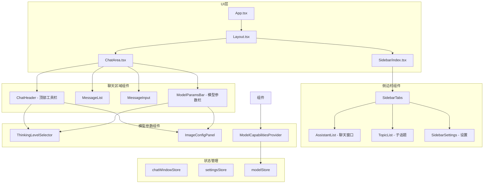
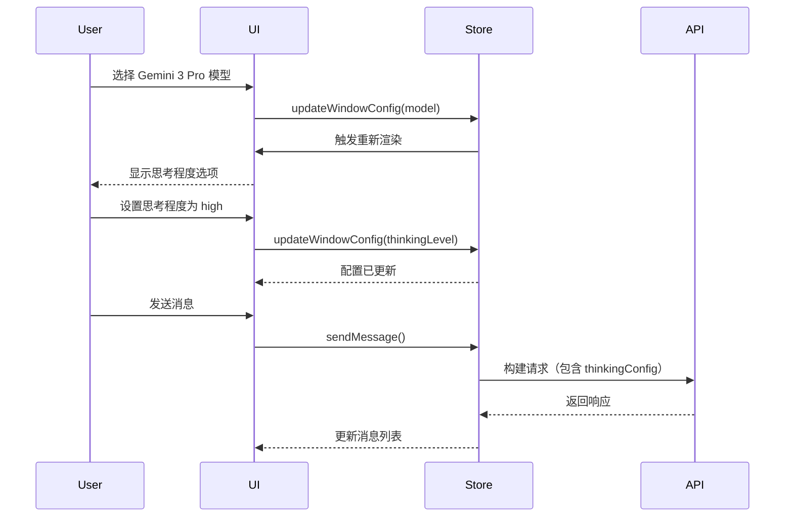

# 设计文档

## 概述

本设计文档描述了 Gemini Chat 应用的 Gemini 3 模型特定参数支持和 UI 布局优化方案。核心目标是：

1. 为 Gemini 3 Pro 添加思考程度 (thinking_level) 参数配置
2. 为 Gemini 3 Pro Image 添加图片宽高比和分辨率参数配置
3. 优化整体 UI 布局，将设置集成到侧边栏
4. 提升视觉设计，增加色彩层次和设计感

## 架构

### 整体架构图



### 数据流架构



## 组件和接口

### 1. 模型能力和参数类型

```typescript
// src/types/models.ts 扩展

/**
 * 思考程度级别
 */
export type ThinkingLevel = 'low' | 'high';

/**
 * 图片宽高比
 */
export type ImageAspectRatio = '1:1' | '16:9' | '9:16' | '4:3' | '3:4';

/**
 * 图片分辨率
 */
export type ImageSize = '1K' | '2K' | '4K';

/**
 * 图片生成配置
 */
export interface ImageGenerationConfig {
  /** 图片宽高比 */
  aspectRatio: ImageAspectRatio;
  /** 图片分辨率 */
  imageSize: ImageSize;
}

/**
 * 模型能力标识（扩展）
 */
export interface ModelCapabilities {
  /** 是否支持 thinking_level 参数 */
  supportsThinking?: boolean;
  /** 是否支持图片生成 */
  supportsImageGeneration?: boolean;
  /** 是否支持 media_resolution 参数 */
  supportsMediaResolution?: boolean;
  /** 最大输入 token 数 */
  maxInputTokens?: number;
  /** 最大输出 token 数 */
  maxOutputTokens?: number;
}

/**
 * 模型高级参数配置（扩展）
 */
export interface ModelAdvancedConfig {
  /** 思考深度级别 */
  thinkingLevel?: ThinkingLevel;
  /** 媒体分辨率 */
  mediaResolution?: MediaResolution;
  /** 图片生成配置 */
  imageConfig?: ImageGenerationConfig;
}

/**
 * 预设模型能力映射
 */
export const MODEL_CAPABILITIES: Record<string, ModelCapabilities> = {
  'gemini-3-pro-preview': {
    supportsThinking: true,
    supportsImageGeneration: false,
    maxInputTokens: 1000000,
    maxOutputTokens: 64000,
  },
  'gemini-3-pro-image-preview': {
    supportsThinking: false,
    supportsImageGeneration: true,
    maxInputTokens: 65000,
    maxOutputTokens: 32000,
  },
  // 其他模型...
};
```

### 2. 聊天窗口配置扩展

```typescript
// src/types/chatWindow.ts 扩展

/**
 * 聊天窗口配置（扩展）
 */
export interface ChatWindowConfig {
  /** 使用的模型 ID */
  model: string;
  /** 生成参数 */
  generationConfig: GenerationConfig;
  /** 系统指令 */
  systemInstruction?: string;
  /** 安全设置 */
  safetySettings?: SafetySetting[];
  /** 高级参数配置 */
  advancedConfig?: ModelAdvancedConfig;
}
```

### 3. 侧边栏组件

```typescript
// src/components/Sidebar/SidebarTabs.tsx

export type SidebarTabId = 'assistants' | 'topics' | 'settings';

export interface SidebarTabsProps {
  /** 当前激活的标签 */
  activeTab: SidebarTabId;
  /** 标签切换回调 */
  onTabChange: (tab: SidebarTabId) => void;
}

// src/components/Sidebar/SidebarSettings.tsx

export interface SidebarSettingsProps {
  /** 是否展开 */
  isExpanded: boolean;
}

export interface SettingsGroupProps {
  /** 分组标题 */
  title: string;
  /** 是否展开 */
  isExpanded: boolean;
  /** 切换展开状态 */
  onToggle: () => void;
  /** 子内容 */
  children: React.ReactNode;
}
```

### 4. 模型参数组件

```typescript
// src/components/ModelParams/ThinkingLevelSelector.tsx

export interface ThinkingLevelSelectorProps {
  /** 当前思考程度 */
  value: ThinkingLevel;
  /** 变更回调 */
  onChange: (level: ThinkingLevel) => void;
  /** 是否禁用 */
  disabled?: boolean;
  /** 显示模式：完整或紧凑 */
  variant?: 'full' | 'compact';
}

// src/components/ModelParams/ImageConfigPanel.tsx

export interface ImageConfigPanelProps {
  /** 当前图片配置 */
  config: ImageGenerationConfig;
  /** 配置变更回调 */
  onChange: (config: Partial<ImageGenerationConfig>) => void;
  /** 是否禁用 */
  disabled?: boolean;
  /** 显示模式 */
  variant?: 'full' | 'compact';
}
```

### 5. 聊天区域组件

```typescript
// src/components/ChatArea/ChatHeader.tsx

export interface ChatHeaderProps {
  /** 聊天窗口 ID */
  windowId: string;
  /** 当前配置 */
  config: ChatWindowConfig;
  /** 配置变更回调 */
  onConfigChange: (config: Partial<ChatWindowConfig>) => void;
}

// src/components/ChatArea/ModelParamsBar.tsx

export interface ModelParamsBarProps {
  /** 当前模型 ID */
  modelId: string;
  /** 高级配置 */
  advancedConfig?: ModelAdvancedConfig;
  /** 配置变更回调 */
  onConfigChange: (config: Partial<ModelAdvancedConfig>) => void;
}
```

## 数据模型

### API 请求构建

```typescript
// src/services/gemini.ts 扩展

/**
 * 构建 Gemini 3 Pro 的思考配置
 */
export function buildThinkingConfig(level: ThinkingLevel): ThinkingConfig {
  return {
    thinkingLevel: level,
  };
}

/**
 * 构建 Gemini 3 Pro Image 的图片配置
 */
export function buildImageConfig(config: ImageGenerationConfig): ImageConfig {
  return {
    aspectRatio: config.aspectRatio,
    imageSize: config.imageSize,
  };
}

/**
 * 构建请求体（扩展支持新参数）
 */
export function buildRequestBody(
  contents: GeminiContent[],
  generationConfig?: GenerationConfig,
  safetySettings?: SafetySetting[],
  systemInstruction?: string,
  advancedConfig?: ModelAdvancedConfig
): GeminiRequest {
  const request: GeminiRequest = { contents };
  
  // ... 现有逻辑 ...
  
  // 添加思考配置（Gemini 3 Pro）
  if (advancedConfig?.thinkingLevel) {
    request.generationConfig = {
      ...request.generationConfig,
      thinkingConfig: buildThinkingConfig(advancedConfig.thinkingLevel),
    };
  }
  
  // 添加图片配置（Gemini 3 Pro Image）
  if (advancedConfig?.imageConfig) {
    request.generationConfig = {
      ...request.generationConfig,
      imageConfig: buildImageConfig(advancedConfig.imageConfig),
    };
  }
  
  return request;
}
```

## 正确性属性

*属性是系统在所有有效执行中应该保持为真的特征或行为——本质上是关于系统应该做什么的形式化陈述。属性作为人类可读规范和机器可验证正确性保证之间的桥梁。*

### Property 1: 思考程度配置映射正确性
*对于任意*思考程度选择（low 或 high），构建的 API 请求中 thinkingConfig.thinkingLevel 应与选择的值一致
**Validates: Requirements 1.3, 1.4**

### Property 2: 思考程度配置持久化
*对于任意*聊天窗口的思考程度配置修改，保存后重新加载，配置应与修改后的值一致
**Validates: Requirements 1.6**

### Property 3: 图片参数配置映射正确性
*对于任意*图片宽高比和分辨率配置，构建的 API 请求中 imageConfig 应包含正确的 aspectRatio 和 imageSize 值
**Validates: Requirements 2.5**

### Property 4: 图片参数配置持久化
*对于任意*聊天窗口的图片参数配置修改，保存后重新加载，配置应与修改后的值一致
**Validates: Requirements 2.6**

### Property 5: 模型参数动态显示
*对于任意*模型选择，显示的参数选项应与该模型的能力匹配（支持思考的模型显示思考程度，支持图片生成的模型显示图片参数）
**Validates: Requirements 1.1, 2.1, 2.3, 3.1, 3.2, 3.3**

### Property 6: 配置值保留
*对于任意*模型切换序列，切换回原模型时，之前配置的参数值应保持不变
**Validates: Requirements 3.5**

### Property 7: 设置实时保存
*对于任意*侧边栏设置修改，修改后立即读取应返回修改后的值
**Validates: Requirements 4.5**

### Property 8: 响应式布局
*对于任意*屏幕宽度，当宽度小于断点值时侧边栏应可收起，当宽度大于断点值时侧边栏应展开
**Validates: Requirements 4.6, 5.6**

### Property 9: 模型参数栏显示
*对于任意*图片生成模型选择，输入框区域应显示图片参数快捷设置
**Validates: Requirements 5.5**

### Property 10: 工具栏模型参数显示
*对于任意* Gemini 3 Pro 模型选择，工具栏应显示当前思考程度；对于任意 Gemini 3 Pro Image 模型选择，工具栏应显示当前图片参数
**Validates: Requirements 6.4, 6.5**

## 错误处理

### 错误类型

```typescript
export enum ModelParamsErrorCode {
  // 配置错误
  INVALID_THINKING_LEVEL = 'INVALID_THINKING_LEVEL',
  INVALID_ASPECT_RATIO = 'INVALID_ASPECT_RATIO',
  INVALID_IMAGE_SIZE = 'INVALID_IMAGE_SIZE',
  
  // 能力不匹配
  MODEL_NOT_SUPPORT_THINKING = 'MODEL_NOT_SUPPORT_THINKING',
  MODEL_NOT_SUPPORT_IMAGE_GEN = 'MODEL_NOT_SUPPORT_IMAGE_GEN',
}
```

### 错误处理策略

1. **配置验证错误**: 显示错误提示，使用默认值
2. **能力不匹配**: 静默忽略不支持的参数，不发送到 API
3. **持久化错误**: 显示错误提示，提供重试选项

## 测试策略

### 单元测试

使用 Vitest 进行单元测试，覆盖：
- 模型能力判断逻辑
- API 请求构建逻辑
- 配置持久化逻辑

### 属性测试

使用 fast-check 进行属性测试，验证正确性属性：
- 配置映射正确性
- 配置持久化一致性
- 模型参数动态显示

每个属性测试配置运行至少 100 次迭代。

### 测试文件命名

- 单元测试: `*.test.ts`
- 属性测试: `*.property.test.ts`

### 测试标注格式

每个属性测试必须包含注释标注：
```typescript
// **Feature: gemini3-params-ui, Property 1: 思考程度配置映射正确性**
```

