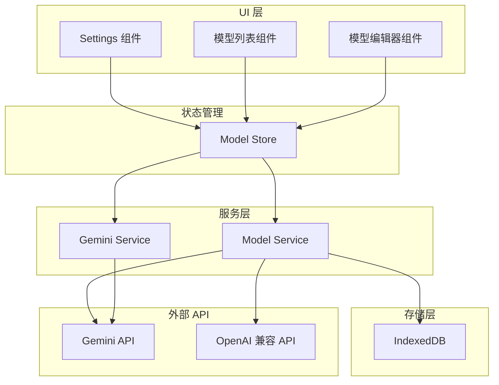

# 设计文档

## 概述

本设计文档描述了 Gemini Chat 应用的高级模型管理功能，包括：
1. 从 API 端点自动获取模型列表（支持 Gemini 和 OpenAI 兼容格式）
2. 自定义模型配置管理
3. 模型别名/重定向机制
4. Gemini 3 系列高级参数支持（thinking_level、media_resolution）
5. 配置持久化存储

## 架构



## 组件和接口

### 1. 类型定义扩展

```typescript
// src/types/models.ts 扩展

/** API 提供商类型 */
export type ApiProvider = 'gemini' | 'openai';

/** 思考深度级别 */
export type ThinkingLevel = 'low' | 'high';

/** 媒体分辨率级别 */
export type MediaResolution = 
  | 'media_resolution_low' 
  | 'media_resolution_medium' 
  | 'media_resolution_high' 
  | 'media_resolution_ultra_high';

/** 模型能力标识 */
export interface ModelCapabilities {
  /** 是否支持 thinking_level 参数 */
  supportsThinking?: boolean;
  /** 是否支持 media_resolution 参数 */
  supportsMediaResolution?: boolean;
  /** 是否支持图像生成 */
  supportsImageGeneration?: boolean;
  /** 最大输入 token 数 */
  maxInputTokens?: number;
  /** 最大输出 token 数 */
  maxOutputTokens?: number;
}

/** 模型高级参数配置 */
export interface ModelAdvancedConfig {
  /** 思考深度级别 */
  thinkingLevel?: ThinkingLevel;
  /** 媒体分辨率 */
  mediaResolution?: MediaResolution;
}

/** 扩展的模型配置 */
export interface ModelConfig extends ModelInfo {
  /** 是否为自定义模型 */
  isCustom?: boolean;
  /** 重定向目标模型 ID（别名功能） */
  redirectTo?: string;
  /** 模型能力 */
  capabilities?: ModelCapabilities;
  /** 高级参数配置 */
  advancedConfig?: ModelAdvancedConfig;
  /** API 提供商 */
  provider?: ApiProvider;
}

/** 模型管理状态 */
export interface ModelManagerState {
  /** 所有模型配置（预设 + 自定义） */
  models: ModelConfig[];
  /** 是否正在加载模型列表 */
  isLoading: boolean;
  /** 错误信息 */
  error?: string;
}
```

### 2. Model Service 接口

```typescript
// src/services/model.ts

/** 检测 API 提供商类型 */
function detectApiProvider(endpoint: string): ApiProvider;

/** 从 Gemini API 获取模型列表 */
async function fetchGeminiModels(endpoint: string, apiKey: string): Promise<ModelConfig[]>;

/** 从 OpenAI 兼容 API 获取模型列表 */
async function fetchOpenAIModels(endpoint: string, apiKey: string): Promise<ModelConfig[]>;

/** 获取模型的有效参数配置（处理重定向） */
function getEffectiveConfig(modelId: string, models: ModelConfig[]): ModelAdvancedConfig;

/** 检测模型是否支持特定能力 */
function detectModelCapabilities(modelId: string): ModelCapabilities;

/** 合并模型列表（远程 + 本地） */
function mergeModels(remote: ModelConfig[], local: ModelConfig[]): ModelConfig[];
```

### 3. Gemini Service 扩展

```typescript
// src/services/gemini.ts 扩展

/** 构建包含高级参数的请求体 */
function buildRequestBodyWithAdvanced(
  contents: GeminiContent[],
  generationConfig?: GenerationConfig,
  safetySettings?: SafetySetting[],
  systemInstruction?: string,
  advancedConfig?: ModelAdvancedConfig
): GeminiRequest;
```

## 数据模型

### 存储结构

```typescript
// IndexedDB 存储结构
interface ModelStorage {
  // 存储键: 'custom_models'
  customModels: ModelConfig[];
  
  // 存储键: 'model_configs'
  // 用于存储用户对预设模型的自定义配置
  modelConfigs: Record<string, Partial<ModelConfig>>;
}
```

### 预设模型能力映射

```typescript
const MODEL_CAPABILITIES: Record<string, ModelCapabilities> = {
  'gemini-3-pro-preview': {
    supportsThinking: true,
    supportsMediaResolution: true,
    maxInputTokens: 1048576,
    maxOutputTokens: 65536,
  },
  'gemini-3-pro-image-preview': {
    supportsThinking: true,
    supportsMediaResolution: true,
    supportsImageGeneration: true,
    maxInputTokens: 65536,
    maxOutputTokens: 32768,
  },
  'gemini-2.5-pro': {
    supportsThinking: true,
    supportsMediaResolution: true,
    maxInputTokens: 1048576,
    maxOutputTokens: 65536,
  },
  'gemini-2.5-flash': {
    supportsThinking: true,
    supportsMediaResolution: true,
    maxInputTokens: 1048576,
    maxOutputTokens: 65536,
  },
  // ... 其他模型
};
```

## 正确性属性

*A property is a characteristic or behavior that should hold true across all valid executions of a system-essentially, a formal statement about what the system should do. Properties serve as the bridge between human-readable specifications and machine-verifiable correctness guarantees.*

### Property 1: API 提供商检测一致性
*For any* API 端点 URL，detectApiProvider 函数应该根据 URL 特征返回正确的提供商类型：包含 `generativelanguage.googleapis.com` 的返回 'gemini'，其他返回 'openai'。
**Validates: Requirements 1.2, 1.3**

### Property 2: 模型合并保持唯一性
*For any* 远程模型列表和本地模型列表，合并后的列表中每个模型 ID 应该唯一，且本地自定义配置优先于远程配置。
**Validates: Requirements 1.4, 5.3**

### Property 3: 模型 CRUD 操作正确性
*For any* 模型配置，添加后列表长度增加 1 且包含该模型；删除后列表长度减少 1 且不包含该模型；编辑后模型属性正确更新。
**Validates: Requirements 2.2, 2.3, 2.4**

### Property 4: 重定向参数解析正确性
*For any* 设置了重定向的模型，getEffectiveConfig 应该返回目标模型的参数配置；清除重定向后应该返回模型自身的配置。
**Validates: Requirements 3.2, 3.3, 3.4, 3.5**

### Property 5: 模型能力检测正确性
*For any* 模型 ID，detectModelCapabilities 应该根据模型 ID 前缀正确识别其支持的能力（Gemini 3 系列支持 thinking，支持图像的模型支持 media_resolution）。
**Validates: Requirements 4.1, 4.2, 4.5**

### Property 6: 高级参数请求构建正确性
*For any* 包含 thinkingLevel 或 mediaResolution 的配置，构建的请求体应该包含正确格式的 thinkingConfig 或 mediaResolution 字段。
**Validates: Requirements 4.3, 4.4**

### Property 7: 持久化往返一致性
*For any* 模型配置，保存到 IndexedDB 后再加载，应该得到等价的配置对象。
**Validates: Requirements 2.5, 5.1, 5.2**

### Property 8: 重置恢复默认值
*For any* 用户自定义配置状态，执行重置操作后，模型列表应该与预设的 GEMINI_MODELS 一致。
**Validates: Requirements 5.4**

## 错误处理

| 错误场景 | 处理方式 |
|---------|---------|
| API 端点无效 | 显示错误提示，保留现有模型列表 |
| API 密钥无效 | 显示 401 错误提示 |
| 网络请求失败 | 显示网络错误提示，保留现有模型列表 |
| 模型 ID 重复 | 提示用户修改 ID 或覆盖现有配置 |
| 循环重定向 | 检测并阻止，显示错误提示 |
| 存储读写失败 | 降级到内存存储，显示警告 |

## 测试策略

### 单元测试
- API 提供商检测函数
- 模型能力检测函数
- 模型合并逻辑
- 重定向参数解析
- 请求体构建（含高级参数）

### 属性测试
使用 fast-check 库进行属性测试：
- 每个属性测试运行至少 100 次迭代
- 测试文件使用 `**Feature: model-management, Property N: xxx**` 格式标注

### 集成测试
- 模型列表获取流程（模拟 API 响应）
- 配置持久化流程
- UI 交互流程
