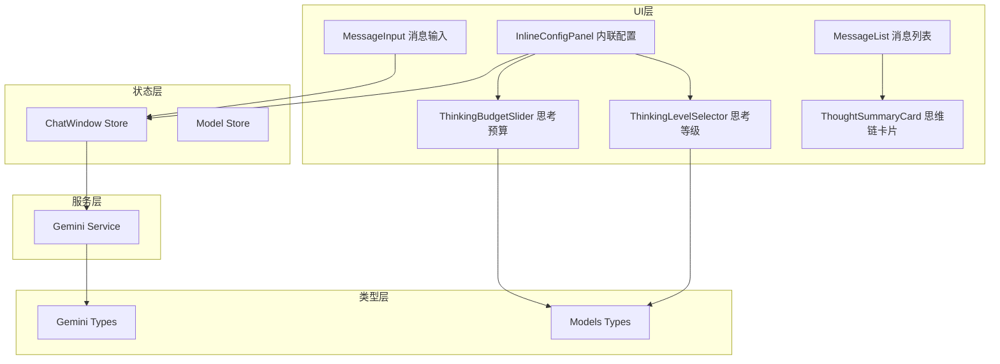
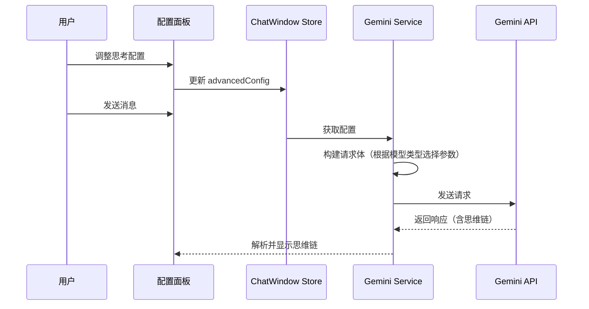

# 设计文档

## 概述

本设计文档描述了 Gemini 聊天应用的思考配置改进功能的技术实现方案。主要包括三个核心改进：

1. **UI 简化**: 移除消息输入组件中的表情和链接按钮
2. **思考配置分离**: 根据模型类型区分思考等级（Gemini 3）和思考预算（Gemini 2.5）两种配置方式
3. **思维链功能**: 添加思维链显示开关和内容展示组件

## 架构

### 整体架构图



### 数据流



## 组件和接口

### 1. 类型定义更新 (src/types/models.ts)

```typescript
/**
 * 思考配置类型
 */
export type ThinkingConfigType = 'level' | 'budget' | 'none';

/**
 * 思考预算配置
 */
export interface ThinkingBudgetConfig {
  /** 最小值 */
  min: number;
  /** 最大值 */
  max: number;
  /** 默认值（-1 表示动态，0 表示关闭） */
  defaultValue: number;
  /** 是否支持禁用（设为 0） */
  canDisable: boolean;
}

/**
 * 模型能力标识（扩展）
 */
export interface ModelCapabilities {
  // ... 现有字段
  /** 思考配置类型 */
  thinkingConfigType?: ThinkingConfigType;
  /** 思考预算配置（仅 budget 类型） */
  thinkingBudgetConfig?: ThinkingBudgetConfig;
  /** 是否支持思维链 */
  supportsThoughtSummary?: boolean;
}

/**
 * 模型高级参数配置（扩展）
 */
export interface ModelAdvancedConfig {
  // ... 现有字段
  /** 思考预算（token 数量，-1 为动态，0 为关闭） */
  thinkingBudget?: number;
  /** 是否显示思维链 */
  includeThoughts?: boolean;
}
```

### 2. Gemini 类型更新 (src/types/gemini.ts)

```typescript
/**
 * 思考配置（扩展支持 budget）
 */
export interface ThinkingConfig {
  /** 思考等级（Gemini 3） */
  thinkingLevel?: 'low' | 'high';
  /** 思考预算（Gemini 2.5） */
  thinkingBudget?: number;
  /** 是否包含思维链 */
  includeThoughts?: boolean;
}

/**
 * 思维链部分
 */
export interface ThoughtPart {
  text: string;
  thought: true;
}

/**
 * Gemini 内容部分（扩展）
 */
export type GeminiPart = GeminiTextPart | GeminiInlineDataPart | ThoughtPart;
```

### 3. 新组件：思考预算滑块 (src/components/ModelParams/ThinkingBudgetSlider.tsx)

```typescript
export interface ThinkingBudgetSliderProps {
  /** 当前值 */
  value: number;
  /** 配置 */
  config: ThinkingBudgetConfig;
  /** 变更回调 */
  onChange: (value: number) => void;
  /** 是否禁用 */
  disabled?: boolean;
}
```

### 4. 新组件：思维链卡片 (src/components/ChatArea/ThoughtSummaryCard.tsx)

```typescript
export interface ThoughtSummaryCardProps {
  /** 思维链内容 */
  content: string;
  /** 是否默认展开 */
  defaultExpanded?: boolean;
}
```

### 5. Gemini 服务更新 (src/services/gemini.ts)

```typescript
/**
 * 构建思考配置
 * 根据模型类型选择正确的参数
 */
export function buildThinkingConfig(
  modelId: string,
  advancedConfig?: ModelAdvancedConfig
): ThinkingConfig | undefined;

/**
 * 解析响应中的思维链
 */
export function extractThoughtSummary(
  chunk: StreamChunk
): { text: string; thought: string } | null;
```

## 数据模型

### 模型能力配置更新

```typescript
export const MODEL_CAPABILITIES: Record<string, ModelCapabilities> = {
  'gemini-3-pro-preview': {
    thinkingConfigType: 'level',
    supportsThoughtSummary: true,
    // ... 其他配置
  },
  'gemini-2.5-pro': {
    thinkingConfigType: 'budget',
    thinkingBudgetConfig: {
      min: 128,
      max: 32768,
      defaultValue: -1,
      canDisable: false,
    },
    supportsThoughtSummary: true,
  },
  'gemini-2.5-flash': {
    thinkingConfigType: 'budget',
    thinkingBudgetConfig: {
      min: 0,
      max: 24576,
      defaultValue: -1,
      canDisable: true,
    },
    supportsThoughtSummary: true,
  },
  'gemini-2.5-flash-lite': {
    thinkingConfigType: 'budget',
    thinkingBudgetConfig: {
      min: 0,
      max: 24576,
      defaultValue: 0,
      canDisable: true,
    },
    supportsThoughtSummary: false,
  },
  'gemini-3-pro-image-preview': {
    thinkingConfigType: 'none',
    supportsThoughtSummary: true,
  },
  // 其他模型默认不支持思考配置
};
```

### 消息模型扩展

```typescript
export interface Message {
  // ... 现有字段
  /** 思维链摘要（可选） */
  thoughtSummary?: string;
}
```


## 正确性属性

*属性是系统在所有有效执行中应该保持为真的特征或行为——本质上是关于系统应该做什么的形式化陈述。属性作为人类可读规范和机器可验证正确性保证之间的桥梁。*

### 属性反思

在分析验收标准后，我识别出以下可合并或冗余的属性：
- 2.1 和 2.2 可以合并为一个属性：根据模型类型显示正确的思考配置组件
- 3.1、3.2、3.3 可以合并为一个属性：根据模型返回正确的思考预算配置
- 4.2 和 4.4 可以合并为一个属性：includeThoughts 参数正确设置
- 5.2 和 5.3 可以合并为一个属性：根据模型能力显示思维链开关

### Property 1: 思考配置类型正确性

*对于任意* 模型 ID，获取其思考配置类型时，gemini-3-pro-preview 应返回 'level'，gemini-2.5-pro/flash/flash-lite 应返回 'budget'，其他模型应返回 'none'

**Validates: Requirements 2.1, 2.2**

### Property 2: 思考预算配置正确性

*对于任意* 支持思考预算的模型，获取其配置时应返回正确的范围和默认值：
- gemini-2.5-pro: min=128, max=32768, default=-1, canDisable=false
- gemini-2.5-flash: min=0, max=24576, default=-1, canDisable=true
- gemini-2.5-flash-lite: min=0, max=24576, default=0, canDisable=true

**Validates: Requirements 3.1, 3.2, 3.3**

### Property 3: API 请求思考参数正确性

*对于任意* 模型和思考配置，构建 API 请求体时：
- gemini-3-pro-preview 应使用 thinkingLevel 参数
- gemini-2.5 系列应使用 thinkingBudget 参数
- 其他模型不应包含思考配置

**Validates: Requirements 3.8**

### Property 4: includeThoughts 参数正确性

*对于任意* 支持思维链的模型和 includeThoughts 设置，构建 API 请求体时应正确设置 includeThoughts 参数

**Validates: Requirements 4.2, 4.4**

### Property 5: 思维链响应解析正确性

*对于任意* 包含思维链的 API 响应，解析后应正确分离思维链内容和普通回复内容

**Validates: Requirements 4.3**

### Property 6: 思维链能力显示正确性

*对于任意* 模型，根据其 supportsThoughtSummary 能力配置，应正确决定是否显示思维链开关

**Validates: Requirements 5.2, 5.3**

## 错误处理

### 配置错误

| 错误场景 | 处理方式 |
|---------|---------|
| gemini-2.5-pro 尝试设置 thinkingBudget=0 | 阻止操作，显示提示"该模型不支持禁用思考" |
| 思考预算超出范围 | 自动限制到有效范围内 |
| 模型不支持思考配置 | 隐藏相关 UI，不发送思考参数 |

### API 错误

| 错误场景 | 处理方式 |
|---------|---------|
| 思维链解析失败 | 忽略思维链，正常显示回复内容 |
| 思考配置参数无效 | 回退到默认配置 |

## 测试策略

### 单元测试

1. **类型和配置测试**
   - 验证 MODEL_CAPABILITIES 配置正确性
   - 验证默认值设置

2. **服务函数测试**
   - `buildThinkingConfig` 函数对不同模型的行为
   - `extractThoughtSummary` 函数的解析逻辑

3. **组件测试**
   - ThinkingBudgetSlider 滑块范围和值显示
   - ThoughtSummaryCard 折叠/展开功能

### 属性测试

使用 **fast-check** 库进行属性测试。

**测试配置要求**:
- 每个属性测试运行至少 100 次迭代
- 使用注释标记属性来源：`// **Feature: thinking-config-improvements, Property N: 属性描述**`

**属性测试用例**:

1. **Property 1 测试**: 生成随机模型 ID，验证返回的思考配置类型正确
2. **Property 2 测试**: 对于支持思考预算的模型，验证配置范围和默认值
3. **Property 3 测试**: 生成随机模型和配置组合，验证请求体使用正确的参数
4. **Property 4 测试**: 生成随机 includeThoughts 设置，验证请求体正确包含参数
5. **Property 5 测试**: 生成包含思维链的模拟响应，验证解析结果正确分离
6. **Property 6 测试**: 生成随机模型能力配置，验证 UI 显示逻辑正确
