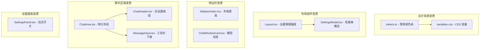
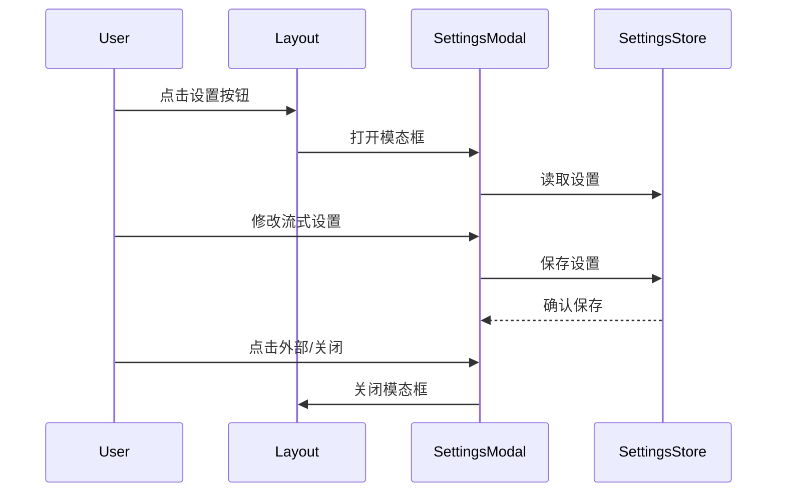

# 设计文档

## 概述

本设计文档描述了 Gemini Chat 应用的 UI 改进方案（第二版）。主要改进包括：

1. 将主题色从蓝色调整为清新的薄荷绿
2. 设置面板使用毛玻璃效果的模态弹窗
3. 修复设置按钮点击问题
4. 术语更改（对话→程序）
5. 程序卡片显示模型信息
6. 简化聊天区域顶部布局
7. 优化输入区域底部布局
8. 使用 Gemini 官方图标
9. 思考程度按钮条件显示
10. 添加流式/非流式输出开关

## 架构

### 组件变更架构图



### 数据流



## 组件和接口

### 1. 设计令牌更新

```typescript
// src/design/tokens.ts - 薄荷绿色系

/**
 * 薄荷绿主题色
 * 清新、舒适的绿色调
 */
export const mintColors = {
  50: '#f0fdf4',   // 最浅 - 背景色
  100: '#dcfce7',  // 浅色 - 悬停背景
  200: '#bbf7d0',  // 较浅 - 选中背景
  300: '#86efac',  // 中浅 - 边框
  400: '#4ade80',  // 中等 - 次要按钮
  500: '#22c55e',  // 主色 - 主要按钮
  600: '#16a34a',  // 较深 - 悬停状态
  700: '#15803d',  // 深色 - 按下状态
  800: '#166534',  // 很深 - 文字
  900: '#14532d',  // 最深 - 强调文字
} as const;
```

### 2. 毛玻璃设置模态框

```typescript
// src/components/Settings/SettingsModal.tsx

interface SettingsModalProps {
  /** 是否打开 */
  isOpen: boolean;
  /** 关闭回调 */
  onClose: () => void;
}

/**
 * 毛玻璃效果的设置模态框
 * 使用 backdrop-filter 实现模糊背景
 */
export function SettingsModal({ isOpen, onClose }: SettingsModalProps);

// CSS 样式
const frostedGlassStyle = {
  backdropFilter: 'blur(12px)',
  backgroundColor: 'rgba(255, 255, 255, 0.8)', // 浅色主题
  // dark: 'rgba(24, 24, 27, 0.8)' // 深色主题
};
```

### 3. 简化的聊天头部

```typescript
// src/components/ChatArea/ChatHeader.tsx

interface SimplifiedChatHeaderProps {
  /** 聊天窗口 ID */
  windowId: string;
  /** 窗口标题 */
  title: string;
  /** 打开设置回调 */
  onOpenSettings: () => void;
}

/**
 * 简化的聊天头部
 * 仅显示标题和设置按钮
 */
export function ChatHeader({ windowId, title, onOpenSettings }: SimplifiedChatHeaderProps);
```

### 4. 模型标签组件

```typescript
// src/components/Sidebar/ModelBadge.tsx

interface ModelBadgeProps {
  /** 模型 ID */
  modelId: string;
}

/**
 * 获取简短的模型显示名称
 */
export function getShortModelName(modelId: string): string {
  // gemini-3-pro -> "3 Pro"
  // gemini-2.0-flash -> "2 Flash"
  // gemini-1.5-pro -> "1.5 Pro"
}

/**
 * 模型标签组件
 * 显示简短名称和对应颜色
 */
export function ModelBadge({ modelId }: ModelBadgeProps);
```

### 5. 流式设置接口

```typescript
// src/stores/settings.ts - 扩展

interface SettingsState {
  // ... 现有字段
  /** 是否启用流式输出 */
  streamingEnabled: boolean;
}

interface SettingsActions {
  // ... 现有方法
  /** 设置流式输出开关 */
  setStreamingEnabled: (enabled: boolean) => void;
}
```

## 数据模型

### 设置状态扩展

```typescript
// src/types/models.ts

/**
 * 扩展的设置状态
 */
export interface ExtendedSettings {
  // ... 现有字段
  
  /** 流式输出设置 */
  streamingEnabled: boolean;
}

/**
 * 默认设置
 */
export const DEFAULT_SETTINGS: ExtendedSettings = {
  // ... 现有默认值
  streamingEnabled: true, // 默认启用流式输出
};
```

## 正确性属性

*属性是系统在所有有效执行中应该保持为真的特征或行为——本质上是关于系统应该做什么的形式化陈述。属性作为人类可读规范和机器可验证正确性保证之间的桥梁。*

### Property 1: 薄荷绿色系完整性
*对于任意*薄荷绿色阶配置，应包含完整的 50-900 色阶键，且每个颜色值应为有效的十六进制颜色格式
**Validates: Requirements 1.1, 1.2**

### Property 2: 设置面板切换一致性
*对于任意*设置面板状态，连续两次点击设置按钮应使面板回到初始状态（打开→关闭→打开 或 关闭→打开→关闭）
**Validates: Requirements 3.4**

### Property 3: 模型标签颜色区分
*对于任意*两个不同系列的模型 ID，getModelColor 函数应返回不同的颜色配置
**Validates: Requirements 5.2**

### Property 4: 模型名称格式化
*对于任意*有效的模型 ID，getShortModelName 函数应返回非空的简短名称字符串
**Validates: Requirements 5.3**

### Property 5: 思考程度选择器条件显示
*对于任意*模型配置，思考程度选择器的显示状态应与模型的 supportsThinking 属性值一致
**Validates: Requirements 9.1, 9.2, 9.3, 9.4**

### Property 6: 流式设置持久化
*对于任意*流式设置值，保存后重新加载应返回相同的值
**Validates: Requirements 10.5**

## 错误处理

### 错误场景

1. **设置面板打开失败**: 显示错误提示，允许重试
2. **设置保存失败**: 显示错误提示，保留用户输入
3. **模型信息加载失败**: 显示默认模型标签

### 错误处理策略

```typescript
// 设置保存错误处理
try {
  await saveSettings(settings);
} catch (error) {
  console.error('设置保存失败:', error);
  showToast('设置保存失败，请重试');
}
```

## 测试策略

### 单元测试

使用 Vitest 进行单元测试，覆盖：
- 颜色系统配置验证
- 模型名称格式化函数
- 设置状态管理逻辑

### 属性测试

使用 fast-check 进行属性测试，验证正确性属性：
- 薄荷绿色系完整性
- 设置面板切换一致性
- 模型标签颜色区分
- 流式设置持久化

每个属性测试配置运行至少 100 次迭代。

### 测试文件命名

- 单元测试: `*.test.ts`
- 属性测试: `*.property.test.ts`

### 测试标注格式

每个属性测试必须包含注释标注：
```typescript
// **Feature: ui-improvements-v2, Property 1: 薄荷绿色系完整性**
```

