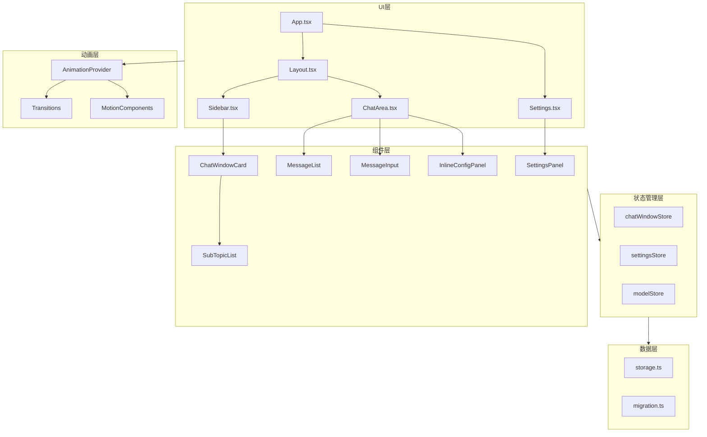
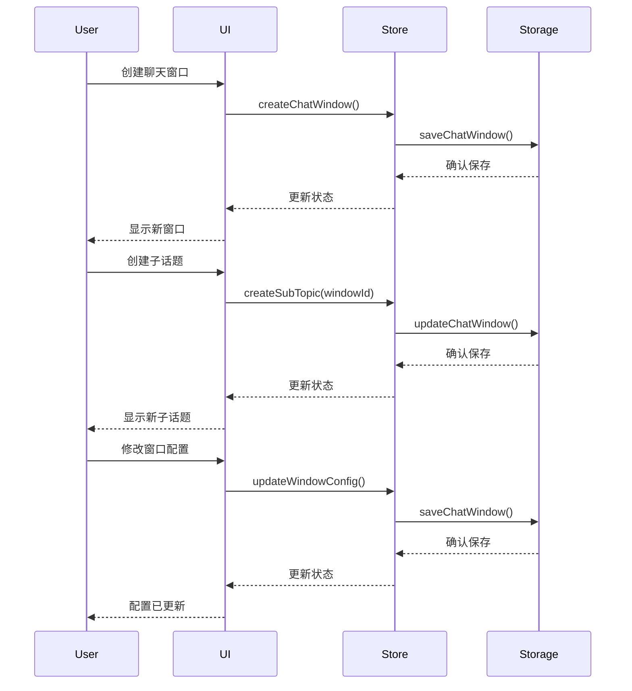

# 设计文档

## 概述

本设计文档描述了 Gemini Chat 应用的全面 UI 重新设计方案。核心目标是创建一个现代化、简约时尚的聊天界面，具有流畅的交互动画、一致的设计语言，以及更灵活的对话管理架构。

主要设计目标：
1. 建立统一的设计系统（颜色、间距、圆角、阴影、字体）
2. 实现流畅的交互动画系统
3. 重构数据模型支持聊天窗口独立配置和子话题
4. 优化设置面板的一致性体验
5. 现代化所有 UI 组件的视觉设计

## 架构

### 整体架构图



### 数据流架构



## 组件和接口

### 设计系统组件

#### 1. 设计令牌（Design Tokens）

```typescript
// src/design/tokens.ts

// 颜色系统
export const colors = {
  // 主色
  primary: {
    50: '#eff6ff',
    100: '#dbeafe',
    200: '#bfdbfe',
    300: '#93c5fd',
    400: '#60a5fa',
    500: '#3b82f6',
    600: '#2563eb',
    700: '#1d4ed8',
    800: '#1e40af',
    900: '#1e3a8a',
  },
  // 中性色
  neutral: {
    50: '#fafafa',
    100: '#f4f4f5',
    200: '#e4e4e7',
    300: '#d4d4d8',
    400: '#a1a1aa',
    500: '#71717a',
    600: '#52525b',
    700: '#3f3f46',
    800: '#27272a',
    900: '#18181b',
  },
  // 语义色
  success: { light: '#10b981', dark: '#34d399' },
  warning: { light: '#f59e0b', dark: '#fbbf24' },
  error: { light: '#ef4444', dark: '#f87171' },
  info: { light: '#3b82f6', dark: '#60a5fa' },
};

// 间距系统（基于 4px）
export const spacing = {
  0: '0',
  1: '4px',
  2: '8px',
  3: '12px',
  4: '16px',
  6: '24px',
  8: '32px',
  12: '48px',
  16: '64px',
};

// 圆角系统
export const borderRadius = {
  none: '0',
  sm: '4px',
  md: '8px',
  lg: '12px',
  xl: '16px',
  full: '9999px',
};

// 阴影系统
export const shadows = {
  none: 'none',
  sm: '0 1px 2px 0 rgb(0 0 0 / 0.05)',
  md: '0 4px 6px -1px rgb(0 0 0 / 0.1)',
  lg: '0 10px 15px -3px rgb(0 0 0 / 0.1)',
  xl: '0 20px 25px -5px rgb(0 0 0 / 0.1)',
};

// 字体系统
export const typography = {
  h1: { size: '2rem', weight: 700, lineHeight: 1.2 },
  h2: { size: '1.5rem', weight: 600, lineHeight: 1.3 },
  h3: { size: '1.25rem', weight: 600, lineHeight: 1.4 },
  body: { size: '1rem', weight: 400, lineHeight: 1.5 },
  small: { size: '0.875rem', weight: 400, lineHeight: 1.5 },
  caption: { size: '0.75rem', weight: 400, lineHeight: 1.4 },
};

// 动画时长
export const durations = {
  fast: '150ms',
  normal: '200ms',
  slow: '300ms',
};

// 缓动函数
export const easings = {
  easeOut: 'cubic-bezier(0.0, 0, 0.2, 1)',
  easeIn: 'cubic-bezier(0.4, 0, 1, 1)',
  easeInOut: 'cubic-bezier(0.4, 0, 0.2, 1)',
};
```

#### 2. 动画组件

```typescript
// src/components/motion/AnimatedPresence.tsx
interface AnimatedPresenceProps {
  children: React.ReactNode;
  animation?: 'fade' | 'slide' | 'scale';
  duration?: number;
}

// src/components/motion/AnimatedList.tsx
interface AnimatedListProps<T> {
  items: T[];
  keyExtractor: (item: T) => string;
  renderItem: (item: T, index: number) => React.ReactNode;
  animation?: 'slide' | 'fade';
}

// src/components/motion/Modal.tsx
interface ModalProps {
  isOpen: boolean;
  onClose: () => void;
  children: React.ReactNode;
  size?: 'sm' | 'md' | 'lg' | 'xl' | 'full';
}
```

### 核心组件接口

#### 1. 设置面板组件

```typescript
// src/components/Settings/SettingsPanel.tsx
interface SettingsPanelProps {
  isOpen: boolean;
  onClose: () => void;
}

interface SettingsTab {
  id: string;
  label: string;
  icon: React.ReactNode;
  component: React.ComponentType;
}

// 设置面板固定尺寸
const SETTINGS_PANEL_SIZE = {
  width: 800,
  height: 600,
  navWidth: 200,
};
```

#### 2. 聊天窗口组件

```typescript
// src/components/ChatArea/ChatArea.tsx
interface ChatAreaProps {
  windowId: string;
  subTopicId: string;
}

// src/components/ChatArea/InlineConfigPanel.tsx
interface InlineConfigPanelProps {
  windowId: string;
  isExpanded: boolean;
  onToggle: () => void;
}

// src/components/ChatArea/SubTopicTabs.tsx
interface SubTopicTabsProps {
  windowId: string;
  subTopics: SubTopic[];
  activeSubTopicId: string;
  onSelect: (id: string) => void;
  onCreate: () => void;
  onDelete: (id: string) => void;
}
```

#### 3. 侧边栏组件

```typescript
// src/components/Sidebar/ChatWindowCard.tsx
interface ChatWindowCardProps {
  window: ChatWindow;
  isActive: boolean;
  onSelect: () => void;
  onEdit: () => void;
  onDelete: () => void;
}

// src/components/Sidebar/SearchBar.tsx
interface SearchBarProps {
  value: string;
  onChange: (value: string) => void;
  placeholder?: string;
}
```

## 数据模型

### 新的数据结构

```typescript
// src/types/models.ts

/**
 * 聊天窗口配置
 */
export interface ChatWindowConfig {
  /** 使用的模型 ID */
  model: string;
  /** 生成参数 */
  generationConfig: GenerationConfig;
  /** 系统指令 */
  systemInstruction?: string;
  /** 安全设置 */
  safetySettings?: SafetySetting[];
}

/**
 * 子话题
 */
export interface SubTopic {
  /** 子话题唯一标识 */
  id: string;
  /** 子话题标题 */
  title: string;
  /** 消息历史 */
  messages: Message[];
  /** 创建时间戳 */
  createdAt: number;
  /** 更新时间戳 */
  updatedAt: number;
}

/**
 * 聊天窗口（原 Conversation）
 */
export interface ChatWindow {
  /** 窗口唯一标识 */
  id: string;
  /** 窗口标题 */
  title: string;
  /** 窗口配置（独立于全局设置） */
  config: ChatWindowConfig;
  /** 子话题列表 */
  subTopics: SubTopic[];
  /** 当前活动的子话题 ID */
  activeSubTopicId: string;
  /** 创建时间戳 */
  createdAt: number;
  /** 更新时间戳 */
  updatedAt: number;
}

/**
 * 旧版对话格式（用于迁移）
 */
export interface LegacyConversation {
  id: string;
  title: string;
  messages: Message[];
  model: string;
  systemInstruction?: string;
  createdAt: number;
  updatedAt: number;
}
```

### 状态管理接口

```typescript
// src/stores/chatWindow.ts

interface ChatWindowState {
  /** 所有聊天窗口 */
  windows: ChatWindow[];
  /** 当前活动窗口 ID */
  activeWindowId: string | null;
  /** 是否正在加载 */
  isLoading: boolean;
  /** 是否正在发送消息 */
  isSending: boolean;
  /** 错误信息 */
  error: string | null;
  /** 流式响应文本 */
  streamingText: string;
  /** 是否已初始化 */
  initialized: boolean;
}

interface ChatWindowActions {
  // 窗口操作
  loadWindows: () => Promise<void>;
  createWindow: (config?: Partial<ChatWindowConfig>) => ChatWindow;
  updateWindow: (id: string, updates: Partial<ChatWindow>) => Promise<void>;
  deleteWindow: (id: string) => Promise<void>;
  selectWindow: (id: string) => void;
  
  // 配置操作
  updateWindowConfig: (id: string, config: Partial<ChatWindowConfig>) => Promise<void>;
  
  // 子话题操作
  createSubTopic: (windowId: string, title?: string) => SubTopic;
  updateSubTopic: (windowId: string, subTopicId: string, updates: Partial<SubTopic>) => Promise<void>;
  deleteSubTopic: (windowId: string, subTopicId: string) => Promise<void>;
  selectSubTopic: (windowId: string, subTopicId: string) => void;
  
  // 消息操作
  sendMessage: (windowId: string, subTopicId: string, content: string, attachments?: Attachment[]) => Promise<void>;
  
  // 工具方法
  getActiveWindow: () => ChatWindow | null;
  getActiveSubTopic: () => SubTopic | null;
  clearError: () => void;
}
```

### 数据迁移

```typescript
// src/services/migration.ts

/**
 * 将旧版 Conversation 迁移到新版 ChatWindow
 */
export function migrateConversationToChatWindow(
  conversation: LegacyConversation,
  defaultConfig: ChatWindowConfig
): ChatWindow {
  const now = Date.now();
  
  // 创建默认子话题，包含原有消息
  const defaultSubTopic: SubTopic = {
    id: generateId(),
    title: '主话题',
    messages: conversation.messages,
    createdAt: conversation.createdAt,
    updatedAt: conversation.updatedAt,
  };
  
  return {
    id: conversation.id,
    title: conversation.title,
    config: {
      model: conversation.model,
      generationConfig: defaultConfig.generationConfig,
      systemInstruction: conversation.systemInstruction,
    },
    subTopics: [defaultSubTopic],
    activeSubTopicId: defaultSubTopic.id,
    createdAt: conversation.createdAt,
    updatedAt: now,
  };
}

/**
 * 检测并执行数据迁移
 */
export async function performMigrationIfNeeded(): Promise<void> {
  const version = await getStorageVersion();
  
  if (version < 2) {
    await migrateV1ToV2();
  }
}
```

## 正确性属性

*属性是系统在所有有效执行中应该保持为真的特征或行为——本质上是关于系统应该做什么的形式化陈述。属性作为人类可读规范和机器可验证正确性保证之间的桥梁。*

### Property 1: 聊天窗口配置独立性
*对于任意*两个聊天窗口 A 和 B，修改窗口 A 的配置（模型、参数、系统指令）不应影响窗口 B 的配置
**Validates: Requirements 4.1, 4.2, 4.3, 4.5**

### Property 2: 新窗口继承默认配置
*对于任意*全局默认配置，创建新聊天窗口后，新窗口的配置应与全局默认配置一致
**Validates: Requirements 4.4**

### Property 3: 聊天窗口配置持久化
*对于任意*聊天窗口配置修改，保存后重新加载，配置应与修改后的值一致
**Validates: Requirements 4.6**

### Property 4: 子话题消息独立性
*对于任意*聊天窗口内的两个子话题 A 和 B，向子话题 A 发送消息不应影响子话题 B 的消息历史
**Validates: Requirements 5.1, 5.3**

### Property 5: 子话题继承父窗口配置
*对于任意*聊天窗口，创建新子话题后，子话题使用的配置应与父窗口配置一致
**Validates: Requirements 5.2**

### Property 6: 设置面板尺寸一致性
*对于任意*设置分类切换操作，切换前后设置面板的尺寸应保持不变
**Validates: Requirements 3.2**

### Property 7: 配置修改实时生效
*对于任意*聊天窗口配置修改，修改后发送的消息应使用新配置
**Validates: Requirements 6.6**

### Property 8: 侧边栏搜索过滤
*对于任意*搜索关键词，过滤后的聊天窗口列表应只包含标题匹配该关键词的窗口
**Validates: Requirements 7.6**

### Property 9: 侧边栏拖拽排序
*对于任意*拖拽排序操作，操作后聊天窗口的顺序应反映拖拽结果
**Validates: Requirements 7.5**

### Property 10: 输入框高度自适应
*对于任意*多行文本输入，输入框高度应在最小 1 行和最大 6 行之间自动调整
**Validates: Requirements 9.3**

### Property 11: 触摸目标尺寸
*对于任意*移动端可交互元素，其尺寸应不小于 44x44 像素
**Validates: Requirements 10.5**

### Property 12: 数据迁移一致性
*对于任意*旧版 Conversation 数据，迁移到 ChatWindow 后，原有消息内容应完整保留
**Validates: Requirements 12.4**

### Property 13: 存储 CRUD 操作一致性
*对于任意* ChatWindow 数据，创建后读取应返回相同数据，更新后读取应返回更新后的数据，删除后读取应返回空
**Validates: Requirements 12.5**

### Property 14: 导入导出数据一致性
*对于任意*导出的数据，重新导入后应与原始数据一致
**Validates: Requirements 12.6**

## 错误处理

### 错误类型

```typescript
// src/types/errors.ts

export enum ErrorCode {
  // 存储错误
  STORAGE_READ_ERROR = 'STORAGE_READ_ERROR',
  STORAGE_WRITE_ERROR = 'STORAGE_WRITE_ERROR',
  MIGRATION_ERROR = 'MIGRATION_ERROR',
  
  // API 错误
  API_CONNECTION_ERROR = 'API_CONNECTION_ERROR',
  API_AUTH_ERROR = 'API_AUTH_ERROR',
  API_RATE_LIMIT = 'API_RATE_LIMIT',
  
  // 验证错误
  INVALID_CONFIG = 'INVALID_CONFIG',
  INVALID_MESSAGE = 'INVALID_MESSAGE',
}

export interface AppError {
  code: ErrorCode;
  message: string;
  details?: unknown;
  recoverable: boolean;
}
```

### 错误处理策略

1. **存储错误**: 显示错误提示，提供重试按钮
2. **API 错误**: 显示具体错误信息，保留用户输入
3. **迁移错误**: 保留原始数据，提供手动迁移选项
4. **验证错误**: 高亮错误字段，显示具体错误信息

## 测试策略

### 单元测试

使用 Vitest 进行单元测试，覆盖：
- 数据模型验证
- 状态管理逻辑
- 工具函数
- 数据迁移逻辑

### 属性测试

使用 fast-check 进行属性测试，验证正确性属性：
- 配置独立性
- 数据持久化一致性
- 搜索过滤正确性
- 数据迁移完整性

每个属性测试配置运行至少 100 次迭代。

### 测试文件命名

- 单元测试: `*.test.ts`
- 属性测试: `*.property.test.ts`

### 测试标注格式

每个属性测试必须包含注释标注：
```typescript
// **Feature: ui-redesign, Property 1: 聊天窗口配置独立性**
```
